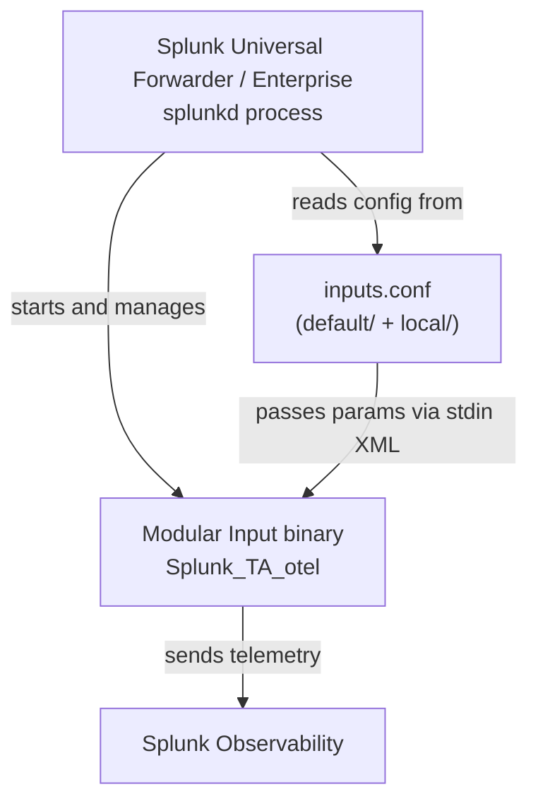
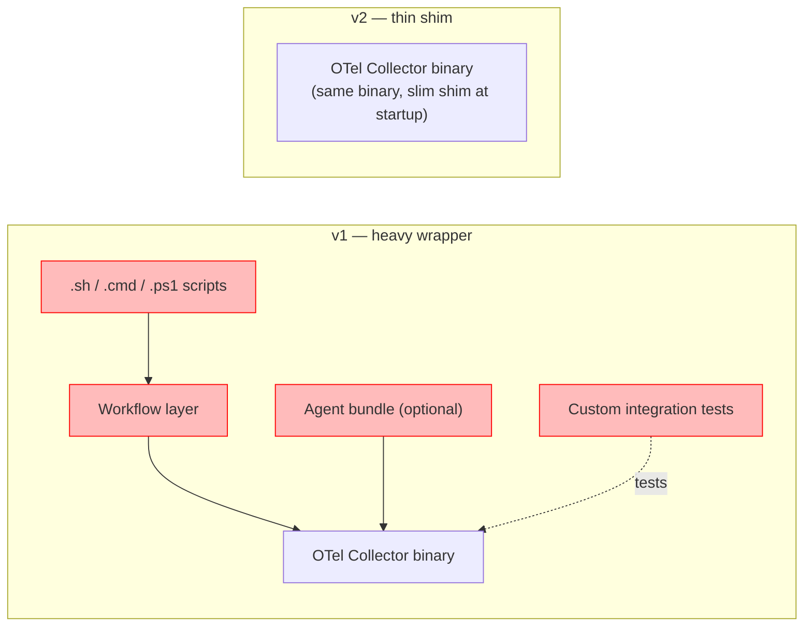
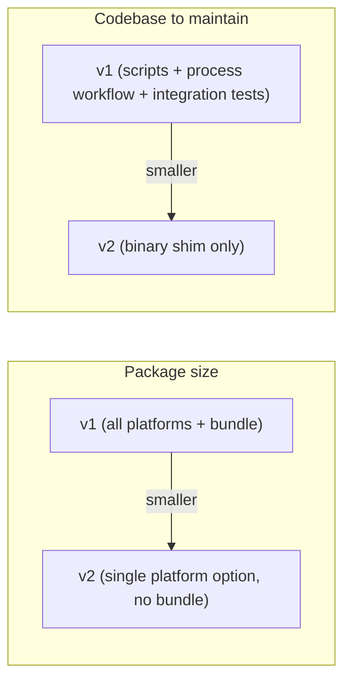

# Splunk Add-On for OpenTelemetry Collector v2

## Topics

1. [What is a Splunk Add-On?](#1-what-is-a-splunk-add-on)
2. [Why v2? The Motivation](#2-why-v2-the-motivation)
3. [What Changed: v1 vs v2](#3-what-changed-v1-vs-v2)
4. [Under the Hood: TA v2 is the Collector](#4-under-the-hood-ta-v2-is-the-collector)
5. [Configuration Walk-through](#5-configuration-walk-through)
6. [Demo](#demo)

---

## 1. What is a Splunk Add-On?

A **Splunk Add-On (TA)** is a packaged extension for Splunk that adds data inputs or knowledge objects. It is _not_ a full UI app — it is the plumbing.



Key concepts:

| Term | Meaning |
|------|---------|
| **Splunk App** | Full UI application inside Splunk |
| **Splunk Add-On (TA)** | Packaged extension — adds data inputs or knowledge |
| **Modular Input** | The binary inside the TA that collects / ships data |
| **`splunkd`** | The Splunk host process — parent of all modular inputs |

---

## 2. Why v2? The Motivation

Two independent but reinforcing problems drove the rewrite.

### Problem 1 — Real customer: disk space constraints

A production customer could not deploy the v1 package because of strict disk-space limits on their hosts. The v1 package bundled _all_ platform binaries (Linux, Windows) and an optional agent-bundle, making the download unnecessarily large for any single deployment target.

### Problem 2 — Maintenance cost and evolution difficulty

v1 accumulated specialized glue:

- Shell scripts (`.sh`) and PowerShell scripts (`.cmd`, `.ps1`) to manage the collector process
- A custom workflow layer on top of the collector lifecycle
- A separate integration-test suite that duplicated what the collector itself already tests

Every change to the collector required matching changes across all those layers, slowing iteration and increasing the risk of regression.



---

## 3. What Changed: v1 vs v2

### Removals that reduced size

1. **OS/platform-specific packages** — besides the default package with Linux and Windows executables, now there are slim packages that ship only the binary for their target OS and architecture (`linux_x86_64`, `windows_x86_64`). No cross-platform fat bundles.
2. **No agent-bundle** — the agent-bundle (auto-instrumentation libraries) is not included and is not an option in v2.

| Package | `.tgz` size MB | Installed size on disk MB |
| --- | ---: | ---: |
| v1 (all platforms + agent-bundle) | 494 | 1,030 |
| v2 (all platforms) | 307 | 859 |
| v2 (single-platform) | 153 | 429 |

### Removals that reduced maintenance cost

3. **Specialized shell/PowerShell scripts** — eliminated entirely; the binary handles its own lifecycle.
4. **Custom workflow layer** — the collector's own lifecycle management is used directly.
5. **Separate integration tests** — the TA-specific integration test suite was removed; the collector's own test coverage applies.

### Net result



---

## 4. Under the Hood: TA v2 is the Collector

The v2 binary **is** the Splunk OpenTelemetry Collector. The only difference is a thin startup shim that bridges the Splunk modular-input protocol to collector startup arguments.

```mermaid
sequenceDiagram
    participant S as splunkd
    box rgba(0, 0, 0, 0.03) Collector binary
        participant B as Modular Input Shim
        participant C as OTel Collector
    end

    S->>B: spawn process
    S->>B: write <input> XML to stdin
    B->>B: parse splunk_* params from XML
    B->>B: map params → env vars & CLI args
    B->>C: hand off to collector main()
    C->>C: load agent_config.yaml<br/>(reads env vars)
    C-->>S: running (long-lived child process)
```



The binary **does not wrap** the collector — it _becomes_ the collector after the parameter translation step. There is no separate collector process.

---

## 5. Configuration Walk-through

### Package layout

```
Splunk_TA_otel/
├── default/
│   └── inputs.conf          ← shipped defaults
├── local/
│   └── inputs.conf          ← admin overrides (takes precedence)
├── README/
│   └── inputs.conf.spec     ← parameter schema
├── configs/
│   └── agent_config.yaml    ← OTel Collector config (references env vars)
├── linux_x86_64/bin/
│   └── Splunk_TA_otel        ← Linux binary
└── windows_x86_64/bin/
    └── Splunk_TA_otel.exe    ← Windows binary
```

### Minimal configuration (`local/inputs.conf`)

The user only needs to set two values:

```ini
[Splunk_TA_otel://default]
splunk_access_token = <your-observability-token>
splunk_realm = us0
```

Everything else has a working default.

### Full parameter reference

| Parameter | Required | Default | Description |
|-----------|----------|---------|-------------|
| `splunk_access_token` | **Yes** | _(empty)_ | Access token for Splunk Observability Cloud |
| `splunk_realm` | **Yes** | _(empty)_ | Realm, e.g. `us0`, `eu0` |
| `splunk_config` | No | `…/configs/agent_config.yaml` | Path to OTel Collector config YAML |
| `splunk_collector_log_level` | No | `error` | Collector log level |
| `splunk_collector_env_vars` | No | _(empty)_ | Extra env vars: `KEY1=VAL1,KEY2=VAL2` |
| `splunk_collector_cmd_args` | No | _(empty)_ | Extra CLI args passed directly to the collector |

### Escape hatch: custom env vars and CLI args

When the standard parameters are not enough, operators can reach the full collector surface area:

```ini
# Inject arbitrary env vars (percent-encode , and = inside values)
splunk_collector_env_vars = MY_ENDPOINT=https://proxy%3A8080/otel,DEBUG=true

# Pass any collector flag directly
splunk_collector_cmd_args = --feature-gates=foo.bar
```

---

## Demo

1. Start self-contained Splunk instance
  ```bash
  docker run -d -p 8000:8000 --platform linux/amd64 --name splunk_demo -e SPLUNK_START_ARGS="--accept-license" -e SPLUNK_GENERAL_TERMS="--accept-sgt-current-at-splunk-com" -e SPLUNK_PASSWORD=changeme splunk/splunk:9.4.0
  ```
2. Install TA v2 from https://splunkbase.splunk.com/app/7125
2. Configure via UI
2. Show logs in self-contained Splunk
